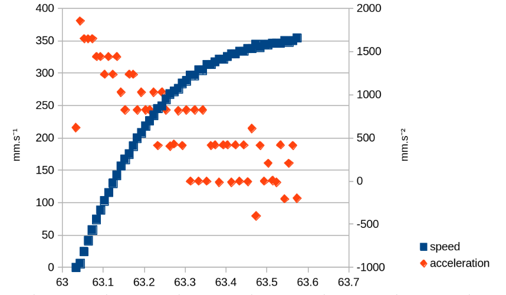
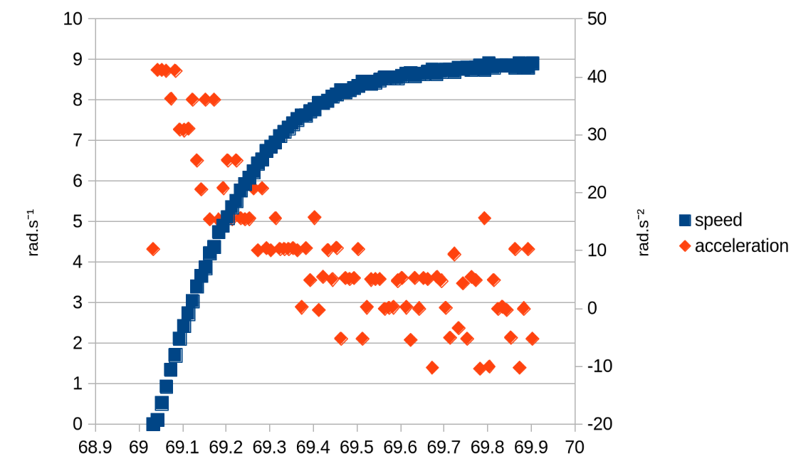
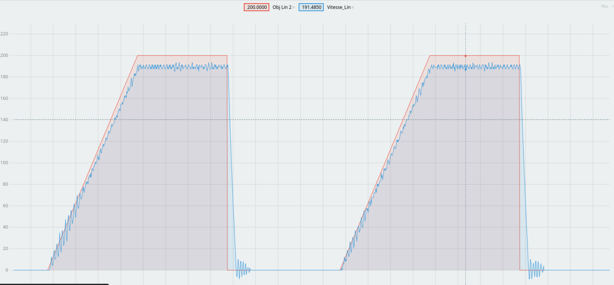
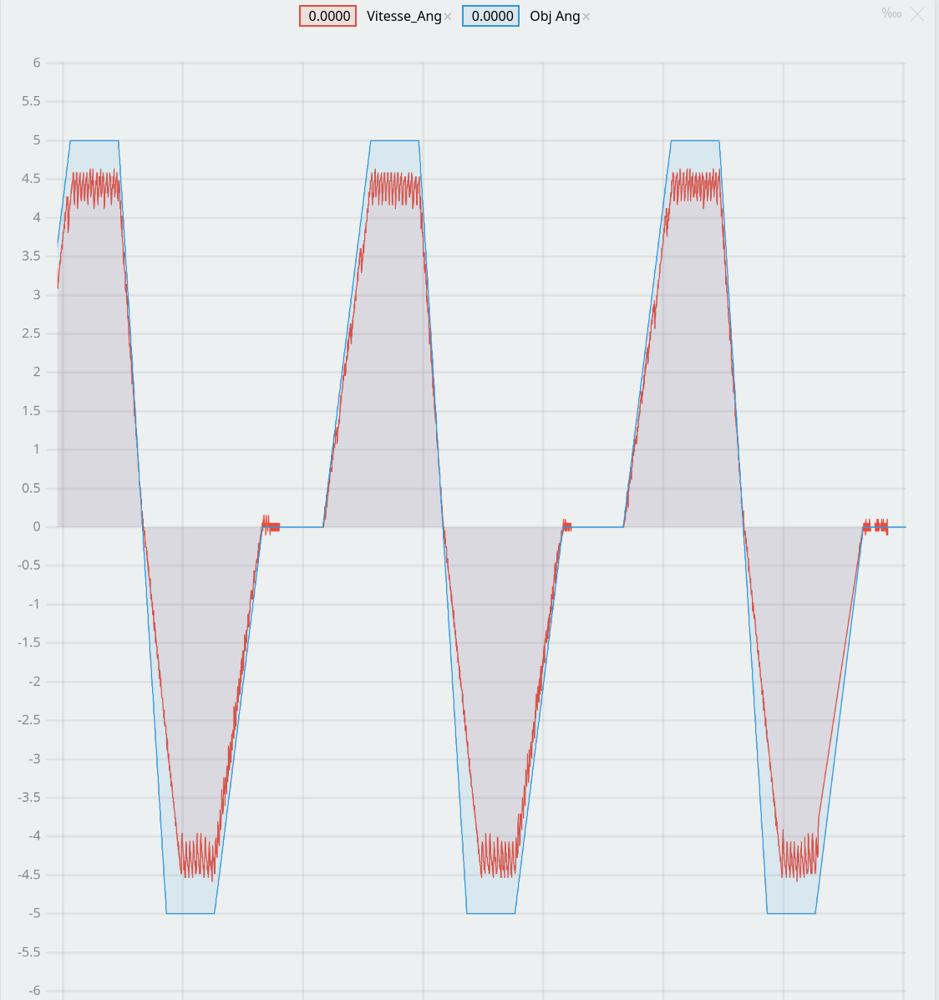

# PAMIs WB Parameters at `5.51V`

## Max experimental accelerations & speed:

### Linear :

### Angular :

## PID values :

### for linear :

Kp : `21` Ki : `0.015` Kd : `0.1`

### for angular :

Kp : `14` Ki : `0.05` Kd : `0`

